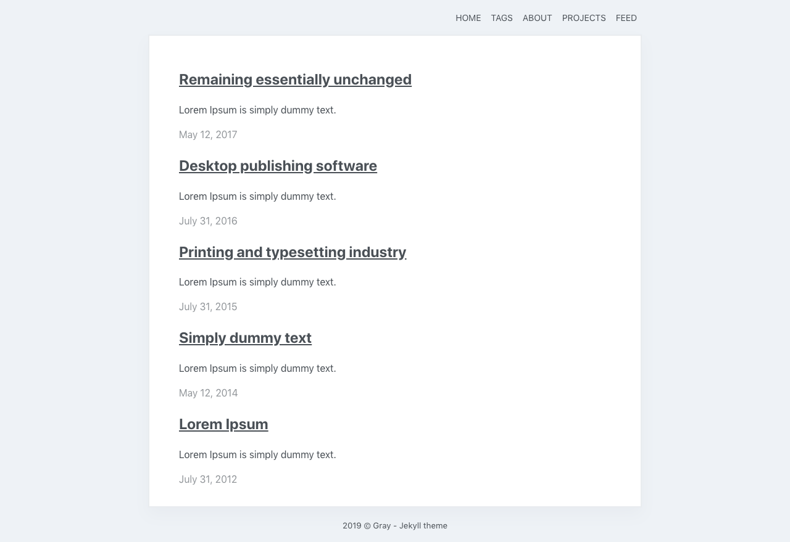

## Gray - Single column blog and portfolio Jekyll theme 

Minimal one-column portfolio/blog theme built for Jekyll. Theme weighs under 3kb. Perfect for your personal website, blog and portfolio.

### Key features

- seo optimized
- weighs under 3kb
- portfolio/blog/tag pages
- AAA, 100/100 scores on Lighthouse, Gmetrix and Webpagetest
- responsive
- inline css
- compressed css, html
- sitemap
- robots.txt
- atom feed
- json feed
- http security headers

# Demo [here](https://gray-jekyll.netlify.com/)